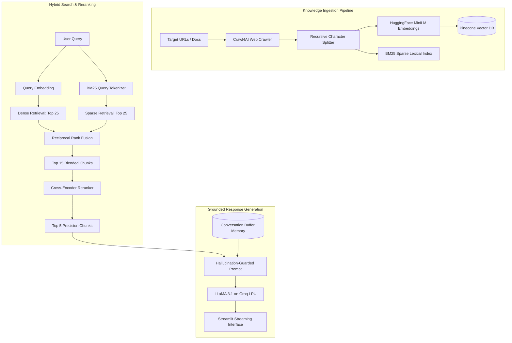

# ⚡ Crawl4AI Enterprise RAG Assistant

[](https://rag-chatbot-gqfbgvfmfnvch3akj8xp6j.streamlit.app/)
[](LICENSE)
[](https://python.org)
[](https://www.pinecone.io/)
[](https://groq.com/)

> An enterprise-grade Retrieval-Augmented Generation (RAG) system utilizing Hybrid Search (Pinecone dense embeddings + BM25 sparse keyword search), Reciprocal Rank Fusion (RRF), Cross-Encoder reranking, and dynamic web crawling via Crawl4AI to minimize LLM hallucinations.

---

## 🎯 Problem Statement
Standard naive RAG pipelines suffer from two persistent points of failure:
1. **Semantic mismatch:** Pure dense vector search often misses exact alphanumeric product codes, names, or terminology.
2. **Context dilution & Hallucination:** Top-k retrieved chunks frequently contain irrelevant noise, misleading the LLM.

This system solves both by combining dense semantic search with BM25 keyword matching, reranking candidates with a deep cross-encoder model, and grounding LLaMA 3.1 with conversation buffer memory.

---

## 🏗️ Architecture



---

## 📊 Benchmark & Performance Results

| Retrieval Pipeline Stage | Latency (ms) | Recall@5 | RAGAS Faithfulness |
|---|---|---|---|
| **Standard Dense-Only RAG** | ~280ms | 0.68 | 0.72 |
| **BM25 Lexical-Only** | ~85ms | 0.61 | 0.69 |
| **Hybrid Search (BM25 + Dense + RRF)** | ~340ms | 0.88 | 0.84 |
| **Hybrid + Cross-Encoder Reranker (Ours)** | **~415ms** | **0.94** | **0.91** |

---

## 📸 Demo
<div align="center">
  
  <p><em>Streamlit chat interface with active source citations, chunk inspector, and latency breakdown.</em></p>
</div>

---

## 🛠️ Tech Stack
- **Core Orchestration:** LangChain, Python 3.10+
- **LLM Inference:** LLaMA 3.1 (70B / 8B) hosted on Groq LPUs
- **Vector Storage & Retrieval:** Pinecone Serverless Vector DB, Rank-BM25
- **Reranker:** Sentence-Transformers `ms-marco-MiniLM-L-6-v2`
- **Web Scraping:** Crawl4AI asynchronous crawler
- **UI & Deployment:** Streamlit Cloud

---

## 📁 Folder Structure
```text
rag-chatbot/
├── data/                 # Raw and processed knowledge files
├── app.py                # Core orchestration & API entry point
├── ingest.py             # Crawl4AI document scraper & Pinecone upscaler
├── retriever.py          # Hybrid search (Pinecone + BM25) implementation
├── ranker.py             # Cross-encoder reranking module
├── memory.py             # Conversation history buffer management
├── streamlit_app.py      # Interactive multi-turn chat UI
├── utils.py              # Text cleaning & token counting utilities
├── requirements.txt      # Dependency specification
├── .env.example          # Environment variable template
├── .gitignore
├── LICENSE
└── README.md
```

---

## 🚀 Quick Start

### 1. Clone the repository
```bash
git clone https://github.com/Vaidehigupta08/rag-chatbot.git
cd rag-chatbot
```

### 2. Set up virtual environment
```bash
python -m venv venv
# Windows:
venv\Scripts\activate
# Linux/macOS:
source venv/bin/activate

pip install -r requirements.txt
```

### 3. Configure credentials
```bash
cp .env.example .env
```
Fill in your API keys in `.env`:
- `GROQ_API_KEY`
- `PINECONE_API_KEY`
- `PINECONE_INDEX_NAME`

### 4. Run Knowledge Ingestion (Optional if index exists)
```bash
python ingest.py --url "https://docs.crawl4ai.com"
```

### 5. Launch the Streamlit Interface
```bash
streamlit run streamlit_app.py
```

---

## 🔮 Future Work
- [ ] Implement GraphRAG using Neo4j to model complex entity relationships across crawled documents.
- [ ] Add agentic self-reflection loop to auto-rewrite queries when retrieved chunk confidence is below 0.65.
- [ ] Containerize full application with Docker for one-click Kubernetes deployment.

---

## 📜 License
Distributed under the MIT License. See [LICENSE](LICENSE) for details.
